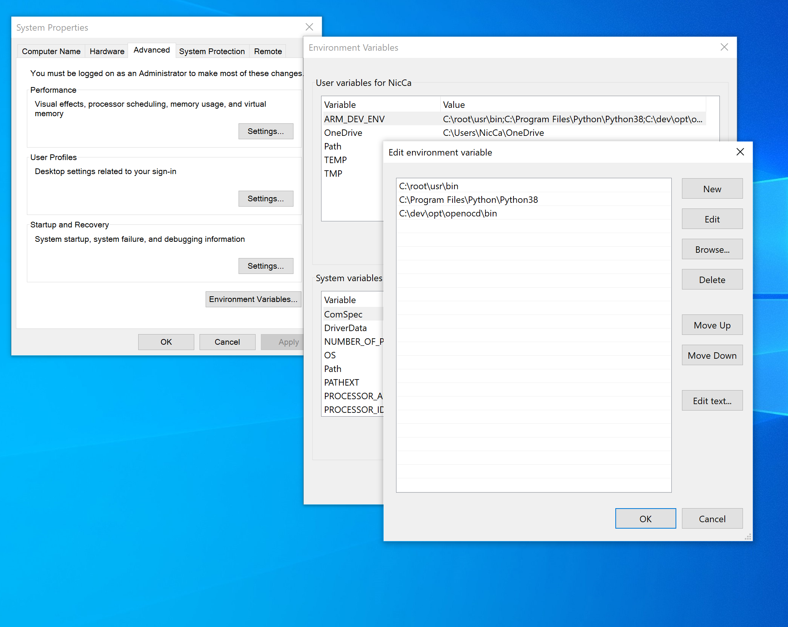
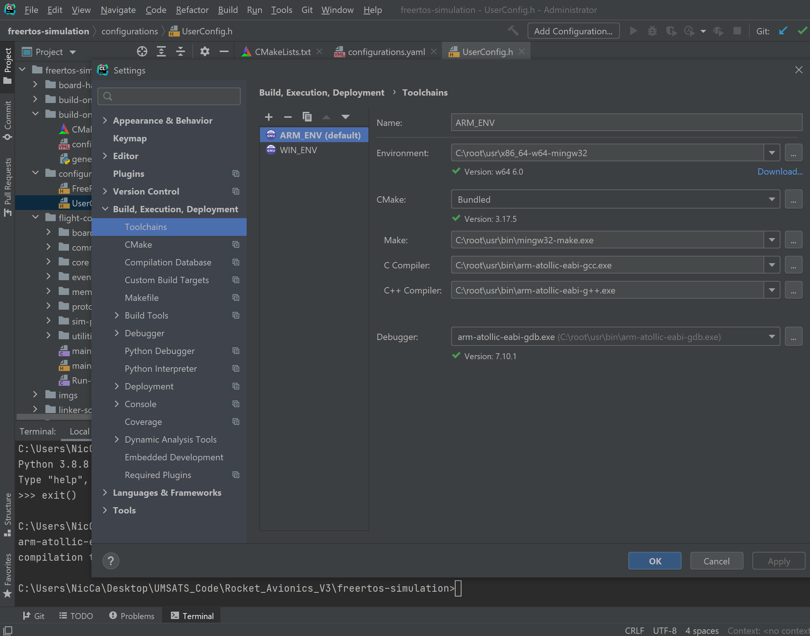
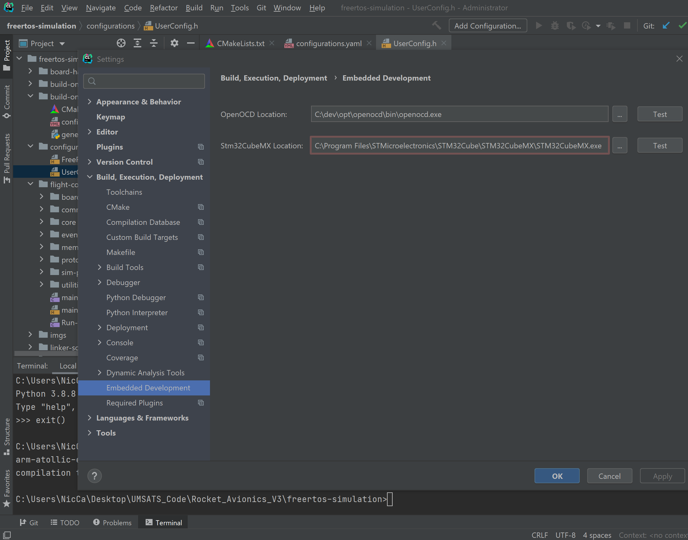
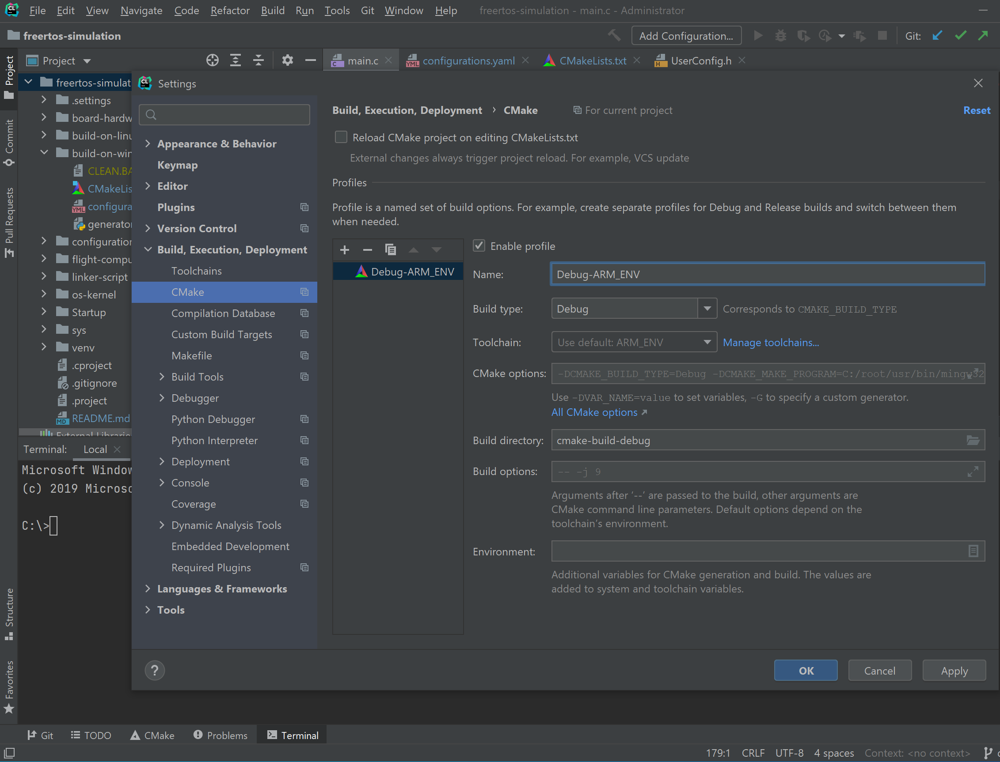
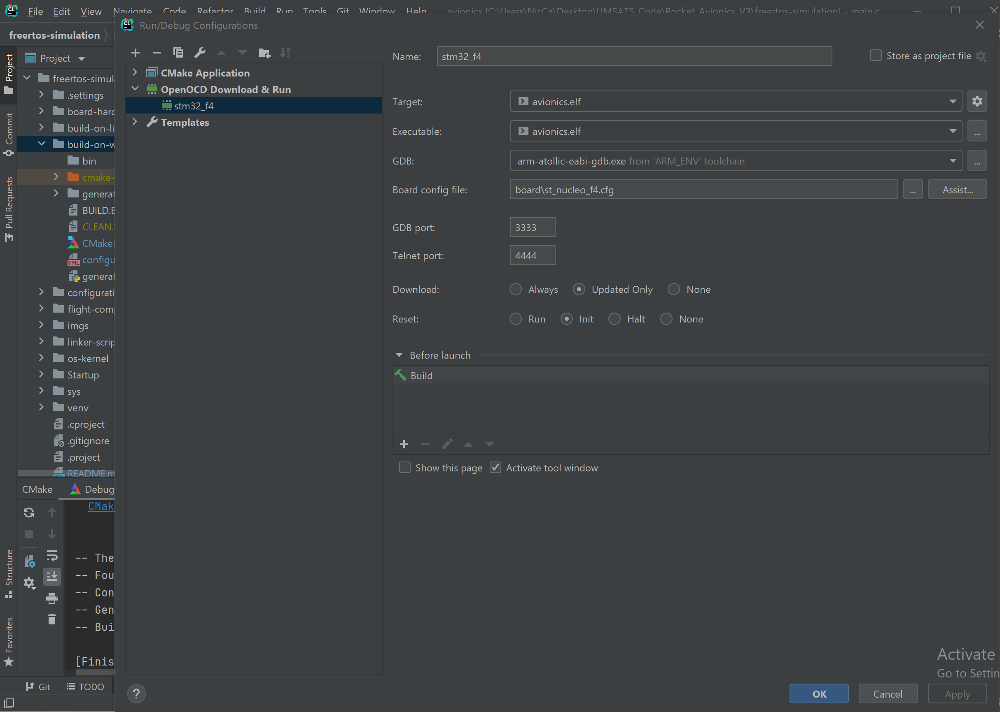
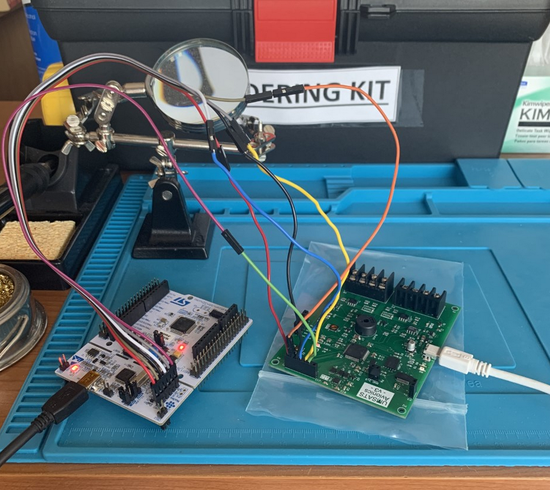

In this README you will come to understand the basics of toolchain systems (including compilers, linkers and makefiles), building processes, difference in platforms.
You will also learn how to setup Windows Environment similar to Linux and compile Avionics-Flight-Computer project with CLion.
I will draw the difference between Atollic Studio and CLion. Also, I will explain why it is better to be able to set up CLion for development.

# How To Run Flight Software
*Requires Windows OS*

### Obtain Software Latest Version

1. Go to -> https://git-scm.com/downloads and download Git for Windows OS.
2. Open a Command Prompt and type `git` to ensure a successfull download.
3. Navigate to the location which you wish to store the flight software. (ex. `cd C:\Users\userx\Desktop\UMSATS_Code\`)
4. Copy the repository link and clone the repository with `git clone https://github.com/UMSATS/repository_name.git`.
5. Wait for the download to complete and we have succefully obtained the latest flight software version.

### Setup The Development Environment
*We need python(3.0 or higher), CLion(IDE) and OpenOCD(debugger), toolchains/MinGW*

1. Download python 3.0 or higher wherever (probably default to `C:\Program Files\Python` folder).
2. In the directory `C:\` create a new folder called `dev` and inside that create a folder called `opt` so you should have the directory `C:\dev\opt`.
3. Install CLion into `C:\dev\opt\clion` and you should have no trouble setting up a free student version or free trial.
4. Download OpenOCD from `https://gnutoolchains.com/arm-eabi/openocd/` and extract the openocd folder so you have the following path `C:\dev\opt\openocd`.
5. Locate the `root` folder where you downloaded the flight software. (ex. `C:\Users\userx\Desktop\UMSATS_Code\Rocket_Avionics_V3\root`)
6. Move the `root` folder to `C:\` so you should have `C:\root\usr\bin`.
7. Now that we have everything we need in place, we need environemnt variables so the executables can be seen system wide. In the Windows taskbar search for 
**environement variables** and select **Edit the system environment variables**, and click **Environment Variables**.
8. In the variable box under **User variables for userx** click **new** and for **Variable name:** put **ARM_DEV_ENV** and for **Variable value:** put 
**C:\root\usr\bin;C:\Program Files\Python\Python38;C:\dev\opt\openocd\bin** and click **Ok**.
9. If you click on the variable you just created you should see the following: 

10. Now we must include this variable we created into the **Path** system environement variable. In the varaible box under **System variables** find the 
**Path** variable and select **Edit...**.
11. Select **New** and enter **%ARM_DEV_ENV%** to add our previously created variable to the path variable.
12. Click **Ok** then **Ok** and finally, **Ok**.

### Ensure Environment Is Configured Properly

1. Run Command Prompt as administrator and type the following:
	1. Type 'cmake'
	2. Type 'mingw32-make'
	3. Type 'python'
	4. Type 'arm-atollic-eabi-gcc'

NOTE: Make sure that the following commands work, if it says:
CMD: 'your command' is not recognized as an internal or external command, operable program or batch file.
PowerShell: The term 'your command' is not recognized as the name of a cmdlet, function, script file, or operable program
Then open another terminal session and do it again, try both terminals CMD and PowerShell, if the problem persists then go
back to Environment Variables and make sure you set up everything like I described and then try again.

2. Run CLion as administrator or call `C:\dev\opt\clion\bin\clion64.exe` through an administrator command prompt.
3. Ensure any other projects that may be open in CLion are closed and open the flight software that should be located in a folder similar to 
`C:\Users\userx\Desktop\UMSATS_Code\Rocket_Avionics_V3\freertos-simulation`.
4. Select the CLion terminal and type the following to ensure CLion can see the evironment we setup:
	1. Type 'cmake'
	2. Type 'mingw32-make'
	3. Type 'python'
	4. Type 'arm-atollic-eabi-gcc'

### Configure CLion Settings For Flight Computer Target Device

1. Go to File -> Settings -> Build, Execution, Deployment -> Toolchains.
2. Click the plus `+` icon and select **MinGW** to setup a MinGW toolchain.
3. Set the fields as follows:
	- Name: ARM_ENV
	- Environment: C:\root\usr\x86_64-w64-mingw32
	- CMake: Bundled
	- Make: C:\root\usr\bin\mingw32-make.exe
	- C Compiler: C:\root\usr\bin\arm-atollic-eabi-gcc.exe
	- C++ Compiler: C:\root\usr\bin\arm-atollic-eabi-g++.exe
	- Debugger: C:\root\usr\bin\arm-atollic-eabi-gdb.exe

NOTE: The above folders/files can be manually selected through browsing your file system using the **...** icon next to the dropdown arrow of each field.

4. Ensure you see the following (ignoring WIN_ENV), then click **Ok**:

5. Setup the OpenOCD debugger by going to File -> Settings -> Build, Execution, Deployment -> Embedded Development and set the following:
	- OpenOCD Location: C:\dev\opt\openocd\bin\openocd.exe
6. Ensure you can see the following and click **Ok**.

7. In the project explorer, navigate to configurations\UserConfig.h and change `userconf_FREE_RTOS_SIMULATOR_MODE_ON` to 0. This turns of simulation 
mode.

8. Go to File -> Settings -> CMake and click the plus `+` then set the fields as follows:
	- Name: Debug-AMR_ENV
	- Build type: Debug
	- Toolchain: ARM_ENV
	- Build directory: cmake-build-debug
9. Ensure the setup looks as follows, click **Apply** and **Ok**:

10. The system should have built with cmake after clicking **Ok** but we can also force system to build by right clicking on the project and selecting 
**Reload CMake Project**.
11. We should now be able to go to Build -> Build Project and generate `avionics.elf` for our debugger.

### Setup Debugger in CLion

1. Go to  Run -> Edit Configurations and click the plus `+` icon and select **OpenOCD Download and Run**.
2. Set the fields as follows:
	- Name: stm32_f4
	- Target: avionics.elf
	- Executable: avionics.elf
	- GDB: arm-atollic-eabi-gdb.exe
	- Board config file: C:\dev\opt\openocd\share\openocd\scripts\board\st_nucleo_f4.cfg
3. Ensure you see the following and click **Apply** and **Ok**.

### Upload, Run and Debug Flight Computer Software on Hardware

1. Setup the following hardware configuration:

NOTE: Be sure to remove the CN2 jumpers on the STM32 Nucleo board to configure the ST-LINK debugger and headers are wired up consecutively left to right 
as shown in the above image. More detail can be found in the **Avionics Setup and User Guide** on the drive located at `Shared drives -> ROCKETS -> Current 
Design Cycle -> AVIONICS -> Flight Computer -> How Tos`.

2. Set a breakpoint on the first non braced line of `main()` in `main.c`.
3. Go to Run -> Debug `stm32_f4` and the software should upload and the debugger should launch.

AtollicTrueStudio:
-----------------
This is a simple eclipse-based IDE, nothing else!

It just sets up the embedded development environment for you. Basically does the job you should be doing in order to understand
how things work. So what exactly does Atollic do?
0. Sets up the internal environment variables: path to ARMTools, etc.
1. Handles creation of Makefile for you: it provides an easier interface for "Include Directories" and other source code files organization
2. Handles creation of entry point assembly file "startup.s" that runs the hardware, setting up the registers. error handlers and makes it call your int main() function
3. Handles creating of a linker script for linker to correctly merge the object files into a target executable
4. Automates compilation process calling arm-atollic-eabi-gcc.exe with proper arguments
5. Handles debugging setup, through ST-Link driver, connecting arm-atollic-eabi-gdb.exe straight to the driver

That is why you do not need to care of anything. You just follow the right instructions and you are good to go!
All the eclipse-based IDEs are notorious for working with the internal environment only within eclipse runtime. That is
why you basically cannot do anything with the project unless you have AtollicStudio. Sometimes it is not the best solution, as it hinders you from learning and also
limits your capabilities to control the project. It is especially bad for embedded development, as you can benefit a lot from knowing how things work and to have a full control
of the project in your head. Making you capable of building and uploading the code to the board with you bare hands using native command console only.

CLion:
-----------------

This is also IDE! But it is not eclipse based, thus, you must set it up yourself. Plus, CLion does not have an internal building project tools and purely relies on CMake Project generating
tool. Benefits are that you will completely understand how project is build an compiled, will have control over the smallest details and CLion is way cooler IDE which is extremely
intelligent compared to dump and stupid eclipse which does not provide any comfort neither for editing nor for debugging. Lastly, the design of eclipse sucks!

Some theory to know before proceeding with CLion.
Before setting things up, if you happened to work on Windows OS, then I just want to let you know that setting up environment
takes more steps than for Linux OS. First thing you need to understand is that Windows works very tight with environment variables,
while Linux uses symbolic links and installation principles. Symbolic links are similar to Windows shortcuts, but the difference
is that the former can act as executable, while Windows shortcuts (also well known as lnk files) cannot be executed.
Also, in Linux, many software libraries especially those that are meant to be used in command line install the corresponding executables
into /usr/bin folder, so you end up having every single tool in one location. Therefore, if some application does not have a dedicated bin
folder that is copied into /usr/bin/ then you can create a symbolic link to its executable and put it into /usr/bin - the effect is identical.
Linux's /usr/bin folder is identical to how Windows Environment Path works. You can treat them the same way.
If you want to have a way to run your application from Linux terminal calling it by its name only, you need to make sure that
you have an executable or symbolic link symbolic link in /usr/bin/.
On Windows if you want to run your application from CMD or any terminal calling it by its name only, you need to make sure that
you have its path (where .exe file is, usually in the root directory of particular application or in some of its nested folders) set in the Environment Path.

Windows Environment Paths:
-----------------

On Windows you have two Environment Paths: System Environment Path and User Environment Path. Both are called as "Path"
So you have two versions of this variable, one is seen system-wide, one is seen user-wide.
You can check your Environment Variables by going to: Control Panel ->System and Security -> Environment -> Advanced System Settings -> Environment Variables
You will see two tables, one is dedicated for USER and one is for SYSTEM. If you want to setup command line only for yourself then use the table above, if you want them to work
for all users, use the one below.

Environment Variables:
-----------------

Both tables know the only variable called "Path" and that is the only thing your Windows system will ever be able to see.
However you can see that there are many entries in each table. Each entry has a name called "variable", so you can edit those variables and add up to a limited number of paths.
Create, for example, a variable called "MY_GAMES" and add there all the folders containing their exe files one by one separated by a semicolon.
Then confirm and apply changes, you need to open a new command line session for the change to work. However it will not work anyways, because Windows only knows about variable named "Path".
To make it work, you need to add you variable "MY_GAMES" to Path by adding "%MY_GAMES%" to it. When you open a new command line session this time, Windows will extract %MY_GAMES% and will incorporate
all the entries of MY_GAMES variables. Now you can run all your games that you added to MY_GAMES from any command line.

C/C++ Toolchains:
-----------------

To build any project from source you need to have certain tools (executables) that are meant to generate object files, link them together into an executable that you will then run on a platform.
Those tools are called compiler and linker. Compiler translate each of your code source files (*.c or *.cpp) into a corresponding object file (*.o) that contain machine code. Linkers take those binary
files and literally merges them together using certain rules and produce a single executable file. Linker's rules are defined in a text configuration file called linker script. Every link operation done
by a linker is controlled by a linker script. This script is written in the linker command language. The main purpose of the linker script is to describe how the sections in the input files should be
mapped into the output file, and to control the memory layout of the output file. Linker also produces map files (*.map) which map memory addresses to functions and variables within the executable (exe, dll, elf, etc)
For embedded systems, map files are a lot more useful. (Although you wouldn't be using Visual C++ for that ;) ) Things like knowing how close you are to running out of program/data memory, and what location
a particular variable resides in, are important.

Makefiles
-----------------

Makefile is a file (by default named "Makefile") containing a set of directives used by a make build automation tool to generate a target/goal (executable). Most often, the makefile directs
Make tool on how to compile and  link a program. A makefile works upon the principle that files only need recreating if their dependencies are newer than the file being created/recreated.
The makefile is recursively carried out (with dependency prepared before each target depending upon them) until everything has been updated (that requires updating) and the primary/ultimate target is complete.
These instructions with their dependencies are specified in a makefile. If none of the files that are prerequisites have been changed since the last time the program was compiled, no actions take place.
Using C/C++ as an example, when a C/C++ source file is changed, it must be recompiled. If a header file has changed, each C/C++ source file that includes the header file must be recompiled to be safe.
Each compilation produces an object file corresponding to the source file. Finally, if any source file has been recompiled, all the object files, whether newly made or saved from previous compilations,
must be linked together to produce the new executable program.

CMake Project Generator:
-----------------

A CMake Generator is responsible for writing the input files for a native build system.

What's a generator?
To understand what a generator is, we need to first look at what is a build system. CMake doesn't compile or link any source files. It used a generator to create configuration files for a build system.
The build system uses those files to compile and link source code files.

So what's a build system?
A build system is a broad term that groups together a set of tools used to generally compile and link source code, but it can also include auxiliary tools used during a build process.
For example, in a multi-stage build system, one executable might be built to be used in the build process of another build. Depending on the tool chain used on a system, CMake will generate multiple files
and folders to allow the building of the source files referenced in the CMakeLists.txt and supporting .cmake files.

Sometimes multiple build systems may be installed on a computer, like for Windows you could have a Visual Studio and MinGW build system. CMake allows you to specify which if these build systems to generate
configuration files for.

CMake includes a number of Command-Line, IDE, and Extra generators.

Command-Line Build Tool Generators
These generators are for command-line build tools, like Make and Ninja. The chosen tool chain must be configured prior to generating the build system with CMake.
The following are supported(**):
- Borland Makefiles
- MSYS Makefiles
- MinGW Makefiles
- NMake Makefiles
- NMake Makefiles JOM
- Ninja
- Unix Makefiles
- Watcom WMake

IDE Build Tool Generators
These generators are for Integrated Development Environments that include their own compiler. Examples are Visual Studio and Xcode which include a compiler natively.
The following are supported(**):
- Visual Studio 6
- Visual Studio 7
- Visual Studio 7 .NET 2003
- Visual Studio 8 2005
- Visual Studio 9 2008
- Visual Studio 10 2010
- Visual Studio 11 2012
- Visual Studio 12 2013
- Visual Studio 14 2015
- Visual Studio 15 2017
- Visual Studio 16 2019
- Green Hills MULTI
- Xcode

Extra Generators
These are generators that create a configuration to work with an alternative IDE tool and must be included with either an IDE or Command-Line generator.
The following are supported(**):

- CodeBlocks
- CodeLite
- Eclipse CDT4
- KDevelop3 (Unsupported after v3.10.3)
- Kate
- Sublime Text 2

If I have a set of C++ files in my project, are these the input files?
Yes, they are some of the input files. For a make build system you also have a MakeFile. For Visual Studio you have a solution file (.sln).
With both systems there are additional files needed that CMake knows how to create given a proper CMakeLists.txt file.

If I'm using Linux, what is my native build system by default? Make?
Generally, yes, but other build systems could be setup like Ninja.

Why do the input files have to be written by the generator if they already exist?
Some source files may already exist, but CMake has the ability to generate header and source files. Also as mentioned above, there are configuration
files that must be generated that depend on the source files supplied in the CMakeLists.txt file.

x86-x64, ARM, embedded ARM and cross-platform toolchain:
-----------------

A toolchain is a set of distinct software development tools that are linked (or chained) together by specific stages such as GCC, binutils and glibc (a portion of the GNU Toolchain). Optionally,
a toolchain may contain other tools such as a debugger or a compiler for a specific programming language, such as C++. Quite often, the toolchain used for embedded development is a cross toolchain,
or more commonly known as a cross compiler. All the programs (like GCC) run on a host system of a specific architecture (such as x86), but they produce binary code (executables) to run on a different
architecture (for example, ARM). This is called cross compilation and is the typical way of building embedded software. It is possible to compile natively, running GCC on your target. Before searching
for a prebuilt toolchain or building your own, it's worth checking to see if one is included with your target hardware. However, a GCC native to your host computer will not always support the instructions
for embedded ARM processors. The instructions and the number of instructions differ significantly across the processors. For example, on your computer, you have x86-x64 processor which is a CISC
(Complex Instruction Set Computing) while ARM processors are RISC (Reduced Instruction Set Computing) for example and support a different set of instructions.

Complex Instruction Set Computer (CISC) processors, like the x86, have a rich instruction set capable of doing complex things with a single instruction. Such processors often have significant amounts
of internal logic that decode machine instructions to sequences of internal operations (microcode).

RISC architectures, in contrast, have a smaller number of more general purpose instructions, that might be executed with significantly fewer transistors, making the silicon cheaper and more power efficient.
Like other RISC architectures, ARM cores have a large number of general-purpose registers and many instructions execute in a single cycle. It has simple addressing modes, where all load/store addresses can
be determined from register contents and instruction fields.

So logically, you cannot port instructions between x86-x64 and ARM, but you are just supposed to use dedicated compilers in order to translate the code into instructions known for a particular processor.
That is why for embedded development Atollic packs dedicated ARM Toolchain located in Atollic/ARMTools/bin folder to be able to translate the code using supported instruction set. This is also usually
referred as application binary interface (ABI). ABI is an interface between two binary program modules; often, one of these modules is a library or operating system facility, and the other is a program
that is being run by a user. ABI defines the low-level binary interface between two or more pieces of software on a particular architecture

ABIs cover details such as:
- a processor instruction set (with details like register file structure, stack organization, memory access types, ...)
- the sizes, layouts, and alignments of basic data types that the processor can directly access
- the calling convention, which controls how functions' arguments are passed and return values are retrieved; for example, whether all parameters are passed on the stack or some are passed in registers,
  which registers are used for which function parameters, and whether the first function parameter passed on the stack is pushed first or last onto the stack
- how an application should make system calls to the operating system and, if the ABI specifies direct system calls rather than procedure calls to system call stubs, the system call numbers
- and in the case of a complete operating system ABI, the binary format of object files, program libraries and so on.

PREFIXES: What is the difference between versions of tools' names?
If you go into Atollic/ARMTools/bin you will find that all files have prefix arm-atollic-eabi, while if you look into mingw32-64/bin/ you will see find no such prefix, also if you go to the corresponding folder
of STM32CubeIDE you will find arm-none-eabi. So, what is the difference?

arm-atollic-eabi: This toolchain targets the ARM architecture, has vendor "atollic", does not target any operating system, and complies with the ARM EABI.
arm-none-eabi: This toolchain targets the ARM architecture, has no vendor, does not target any operating system, and complies with the ARM EABI.
arm-none-linux-gnueabi or nothing: This toolchain targets the ARM architecture, has no vendor, creates binaries that run on the Linux operating system,
and uses the GNU EABI. It is used to target ARM-based Linux systems.

NOTE: that 'abi' refers to the same application binary interface (ABI)

MinGW Environment
-----------------

So, we have talked about ABI. Now we need to talk about API (Application Programming Interface).
Windows uses win32 API to provide development environment, while of course win32 forwards the calls to native API.
Native API is something used across all the platforms, it mostly provides system calls which all the other libraries, including win32 use.
Most of the Windows APIs internally invoke the Native APIs. All APIs of the various available subsystems invoke the Native APIs to perform the actual operation.
Native API is also often referred as POSIX. POSIX stands for Portable Operating System Interface, and is an IEEE standard designed to facilitate application portability.
POSIX is an attempt by a consortium of vendors to create a single standard version of UNIX. If they are successful, it will make it easier to port applications between hardware platforms.
Therefore, in order to access native C Runtime Environment, we need POSIX API for that which is provided in Minimalist GNU for Windows referred to as MinGW

MinGW, a contraction of "Minimalist GNU for Windows", is a minimalist development environment for native Microsoft Windows applications.
MinGW provides a complete Open Source programming tool set which is suitable for the development of native MS-Windows applications, and which do not depend on any 3rd-party C-Runtime DLLs.
MinGW compilers provide access to the functionality of the Microsoft C runtime and some language-specific runtimes.
Primarily intended for use by developers working on the native MS-Windows platform, but also available for cross-hosted use, MinGW includes:
- A port of the GNU Compiler Collection (GCC), including C, C++, ADA and Fortran compilers;
- GNU Binutils for Windows (assembler, linker, archive manager)
- A command-line installer, with optional GUI front-end, (mingw-get) for MinGW and MSYS deployment on MS-Windows
- A GUI first-time setup tool (mingw-get-setup), to get you up and running with mingw-get.

MinGW gives us access to native C environment, that is why we use it in the first place.